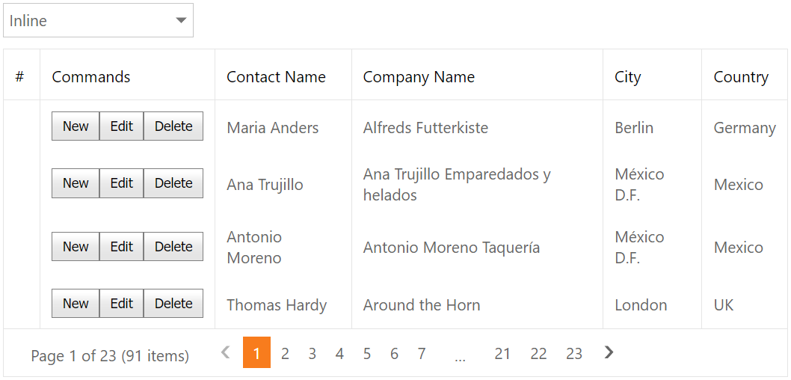

# Grid View for ASP.NET Web Forms - How to emulate command button functionality
<!-- run online -->
**[[Run Online]](https://codecentral.devexpress.com/e4664/)**
<!-- run online end -->

This example demonstrates how to add custom buttons to a templated column and configure the grid's cell edit functionality based on the edit mode. You can choose the edit mode in the combo box editor.



## Overview

1. Specify a column's [DataItemTemplate](https://docs.devexpress.com/AspNet/DevExpress.Web.GridViewDataColumn.DataItemTemplate) property and add custom **New**, **Edit**, and **Delete** buttons to the template. For **Edit** and **Delete** buttons, handle their server-side `Init` events to access a button's template container and get the container's visible index. For all buttons, handle their client-side `Click` events and call the corresponding grid's method to edit data.

    ```aspx
    <dx:GridViewDataColumn Caption="Commands">
        <DataItemTemplate>
            <table>
                <tr>
                    <td>
                        <dx:ASPxButton ID="btnNew" runat="server" Text="New" AutoPostBack="false">
                            <ClientSideEvents Click="function() { grid.AddNewRow(); }" />
                        </dx:ASPxButton>
                    </td>
                    <td>
                        <dx:ASPxButton ID="btnEdit" runat="server" Text="Edit" AutoPostBack="false"
                            OnInit="btnEdit_Init" />
                    </td>
                    <td>
                        <dx:ASPxButton ID="btnDelete" runat="server" Text="Delete" AutoPostBack="false"
                            OnInit="btnDelete_Init" />
                    </td>
                </tr>
            </table>
        </DataItemTemplate>
        <!-- ... -->
    </dx:GridViewDataColumn>
    ```

    ```csharp
    protected void btnEdit_Init(object sender, EventArgs e) {
        var btn = (sender as ASPxButton);
        var nc = btn.NamingContainer as GridViewDataItemTemplateContainer;
        btn.ClientSideEvents.Click = String.Format("function() {{ grid.StartEditRow({0}); }}", nc.VisibleIndex);
    }

    protected void btnDelete_Init(object sender, EventArgs e) {
        var btn = (sender as ASPxButton);
        var nc = btn.NamingContainer as GridViewDataItemTemplateContainer;
        btn.ClientSideEvents.Click = String.Format("function() {{ grid.DeleteRow({0}); }}", nc.VisibleIndex);
    }
    ```

2. Specify a column's [EditItemTemplate](https://docs.devexpress.com/AspNet/DevExpress.Web.GridViewDataColumn.EditItemTemplate) property and add custom **Update** and **Cancel** buttons to the template. Handle client-side `Click` events and call the grid's `UpdateEdit` and `CancelEdit` methods in handlers.

    ```aspx
    <dx:GridViewDataColumn Caption="Commands">
        <!-- ... -->
        <EditItemTemplate>
            <table>
                <tr>
                    <td>
                        <dx:ASPxButton ID="btnUpdate" runat="server" Text="Update" AutoPostBack="false">
                            <ClientSideEvents Click="function() { grid.UpdateEdit(); }" />
                        </dx:ASPxButton>
                    </td>
                    <td>
                        <dx:ASPxButton ID="btnCancel" runat="server" Text="Cancel" AutoPostBack="false">
                            <ClientSideEvents Click="function() { grid.CancelEdit(); }" />
                        </dx:ASPxButton>
                    </td>
                </tr>
            </table>
        </EditItemTemplate>
        <EditFormSettings Visible="false" />
    </dx:GridViewDataColumn>
    ```

3. For the grid's edit form mode, specify the control's [Templates.EditForm](v) property and set the [ReplacementType](https://docs.devexpress.com/AspNet/DevExpress.Web.ASPxGridViewTemplateReplacement.ReplacementType) property to `EditFormEditors`. Add custom **Update** and **Cancel** buttons to the template and handle their client-side `Click` events as described in the previous step.

    ```aspx
    <dx:ASPxGridView ID="grid" runat="server" DataSourceID="dataSource" KeyFieldName="CustomerID" ...>
        <!-- ... -->
        <Templates>
            <EditForm>
                <dx:ASPxGridViewTemplateReplacement ID="Editors" runat="server"
                    ReplacementType="EditFormEditors" />
                <!-- ... -->
            </EditForm>
        </Templates>
    </dx:ASPxGridView>
    ```

## Files to Review

* [Default.aspx](./CS/WebSite/Default.aspx) (VB: [Default.aspx](./VB/WebSite/Default.aspx))
* [Default.aspx.cs](./CS/WebSite/Default.aspx.cs) (VB: [Default.aspx.vb](./VB/WebSite/Default.aspx.vb))

## Documentation

* [Edit Data in Grid](https://docs.devexpress.com/AspNet/3712/components/grid-view/concepts/edit-data)
* [Grid View Templates](https://docs.devexpress.com/AspNet/3718/components/grid-view/concepts/templates)

## More Examples

* [Grid View for ASP.NET MVC - How to emulate command button functionality](https://github.com/DevExpress-Examples/how-to-emulate-the-command-column-with-a-data-column-dataitemtemplate-e4058)
